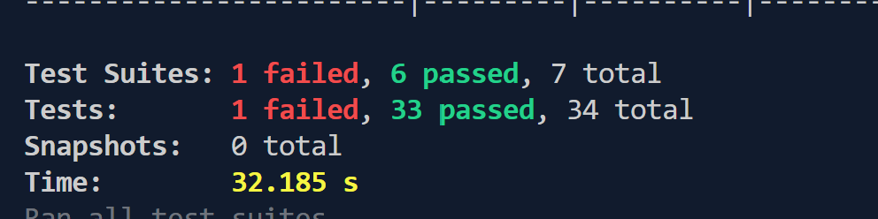

# Rendu TP Noté Nest 

Ce rendu présente les travaux réalisés tout au long des travaux pratiques (TP). Il sera structuré en quatre parties distinctes : 

- Initialisation du serveur Nest
- Création de la base de données (BDD)
- Implémentation des différents modules (Rank, Players, Match)
- Implémentation des tests (unitaires et d'intégration)

Chaque section détaillera les étapes franchies, les choix techniques effectués ainsi que les défis rencontrés et résolus. Ce processus a impliqué non seulement l'intégration et la configuration du framework NestJS pour le backend, mais aussi la mise en place d'une base de données fonctionnelle, la création de services et contrôleurs pour gérer différentes entités, et enfin l'implémentation de tests pour garantir la fiabilité du système. Chaque phase a été réalisée dans le but d'assurer un développement robuste, évolutif et bien documenté.


## Initialisation du serveur Nest 

La première tâche que j'ai effectuée a été de lire un maximum de documentation sur le sujet afin de regrouper toutes les informations nécessaires à la bonne compréhension du projet. Pour ce faire, j'ai consulté les différents fichiers `README.md` disponibles, ce qui m'a permis de m'assurer que je comprenais bien l'architecture du projet et les choix techniques à faire.

Ensuite, j'ai initialisé le serveur avec NestJS et j'ai immédiatement modifié l'entry point du client pour qu'il pointe vers le serveur. Cette étape était cruciale pour établir la communication entre le client et le backend, et pour garantir que le serveur fonctionne dès que le client envoie des requêtes.

J'ai exécuté la commande suivante pour initialiser le serveur avec NestJS, tout en choisissant TypeScript comme langage et `pnpm` comme gestionnaire de paquets :


```
pnpm nest new apps/realtime-elo-ranker-server --skip-git -l TS --strict --package-manager pnpm
```


Une fois le serveur créé, j'ai intégré des scripts dans le fichier `package.json` à la racine du projet pour faciliter le démarrage des différents services. Cela permet de gagner du temps et de rendre les commandes plus simples à exécuter. Par exemple, j'ai ajouté le script suivant pour démarrer la documentation Swagger :

```
"docs:swagger:start": "pnpm run --filter ./docs/swagger start"
```


Ce script permet de lancer facilement la documentation Swagger, qui est un outil essentiel pour comprendre les endpoints exposés par l'API.

J'ai également ajouté un script pour démarrer le serveur en mode développement :


``` 
"apps:server:dev": "pnpm run --filter ./apps/realtime-elo-ranker-server start:dev",
```

Ce script permet de lancer le serveur NestJS en mode développement, ce qui facilite les tests et la gestion du code pendant la phase de développement.


## Création de la BDD

Pour réaliser cette partie, j'ai suivi la documentation suivante afin de bien comprendre les étapes nécessaires à l'intégration de TypeORM avec NestJS :

[Getting Started with NestJS and TypeORM: A Beginner's Guide](https://dev.to/souhailxedits/getting-started-with-nestjs-and-typeorm-a-beginners-guide-ggc)

J'ai ensuite adapté les concepts et les données de cette documentation aux spécificités de notre projet, en tenant compte des exigences particulières liées à la gestion des entités et des relations dans la base de données.

Cette documentation m'a permis de structurer correctement l'architecture nécessaire pour la gestion des données dans la base de données. Par exemple, j'ai créé un fichier pour l'entité `Player` dans le répertoire `serveur/src/typeorm/entities/player.entity.ts`. Ce fichier contient la définition de l'entité `Player`, qui représente un joueur avec ses attributs (tels que l'ID et le rang).

Après cela, j'ai modifié le fichier `app.module.ts` pour m'assurer que les entités soient bien détectées et créées lors du démarrage de l'application. Pour ce faire, j'ai ajouté la configuration suivante dans la section des imports de `app.module.ts` :

```
  imports: [
    TypeOrmModule.forRoot({
      type: 'sqlite',
      database: 'db.sqlite',
      entities: [__dirname + '/**/*.entity{.ts,.js}'],
      synchronize: true,
    }),
```

Cette configuration permet de connecter l'application à une base de données SQLite et de synchroniser automatiquement les entités avec la base de données. En utilisant la méthode __dirname + '/**/*.entity{.ts,.js}', NestJS recherchera toutes les entités dans le projet et les intégrera à la configuration de TypeORM.


Voici l'unique table du projet, qui représente l'entité `Player`. Cette table est utilisée pour stocker les informations relatives aux joueurs. Elle est définie à l'aide de TypeORM, qui permet de mapper cette classe JavaScript/TypeScript à une table dans la base de données.

La classe `Player` est marquée avec le décorateur `@Entity()`, ce qui permet à TypeORM de la reconnaître comme une entité liée à une table dans la base de données. Chaque instance de cette classe correspondra à une ligne dans la table `Player`.

Le code de l'entité est le suivant :

```typescript
import { Entity, Column, PrimaryColumn } from 'typeorm';

@Entity()
export class Player {
  @PrimaryColumn()
  id: string;

  @Column()
  rank: number;
}
```

Cette entité constitue la structure de base des données relatives aux joueurs.

## Implémentation des différents modules (Rank, Players, Match)

## Implémentation des différents modules (Rank, Players, Match)

Dans cette section, nous allons voir comment j'ai implémenté les différents modules de ce projet.

### Structuration des modules

Tout d'abord, j'ai pris soin d'examiner la documentation Swagger générée pour identifier les différentes routes de l'API et ainsi structurer correctement les modules du projet.

Les principales routes observées sont les suivantes :

```
- Rank
- Players
- Match


```

Ces routes permettent d'organiser l'application en modules distincts, chacun gérant une partie spécifique de la logique métier.

Pour créer chacun de ces modules j'ai utilisé ces commandes : 

- pnpm nest generate controler players
- pnpm nest generate service players
- pnpm nest generate module players

Ces commandes génèrent automatiquement les fichiers nécessaires à la mise en place des modules Players, Rank et Match. Elles permettent également de suivre l'architecture modulaire de NestJS, facilitant la maintenance et l'évolutivité du projet.

### Gestion des DTO (Data Transfer Objects)
Une fois les modules en place, j'ai analysé les données d'entrée des contrôleurs afin de créer des DTO (Data Transfer Objects). Les DTO permettent de structurer, typer et valider les données reçues par l'API.

Voici un exemple de DTO pour le module `Players` :

```typescript
export class CreatePlayerDto {
    readonly id: string;
    readonly rank: number;
}
```

Ce DTO est ensuite utilisé dans le contrôleur pour valider les données des requêtes entrantes :

```typescript
import { Body, Controller, Get } from '@nestjs/common';
import { CreatePlayerDto } from './dto/create-player.dto';
import { PlayersService } from './players.service';

@Controller('api/player')
export class PlayerController {
    constructor(private readonly playersService: PlayerService) {}

    @Get()
    findAll(callback: (err: any, players: Player[]) => void): void {
        this.playersService.findAll(callback);
    }
}
```

### Implémentation de la logique métier et gestion des événements en temps réel

Après avoir structuré les modules et implémenté les contrôleurs, j'ai intégré la logique métier de l'application en prenant soin d'optimiser la gestion des appels asynchrones.

#### Utilisation de Promises et Callbacks

J'ai volontairement évité l'utilisation de `async/await` et privilégié l'utilisation des **Promises** et des **callbacks** afin de garantir une meilleure compatibilité avec le modèle d'exécution de NestJS et améliorer les performances. Cela permet également de mieux gérer les événements asynchrones, en particulier pour les mises à jour en temps réel.

#### Mise en place d'un contrôleur SSE (Server-Sent Events)

Pour offrir une expérience utilisateur plus fluide, j'ai mis en place un contrôleur **SSE (Server-Sent Events)**. Ce système permet au serveur d'envoyer automatiquement des mises à jour au client dès qu'une nouvelle donnée est ajoutée ou modifiée, évitant ainsi des requêtes répétitives côté client (polling).

Grâce à cette approche, le client peut recevoir en temps réel les changements sur les données, sans avoir besoin de rafraîchir manuellement la page ou d'effectuer des requêtes périodiques.

#### Émission des événements et gestion des erreurs

Chaque fois qu'une donnée est traitée (création, modification, mise à jour), j'ai émis un événement via un **EventEmitter** afin de notifier les abonnés (clients SSE). J'ai également mis en place des mécanismes de gestion d'erreurs (`catch`) pour éviter les interruptions en cas d'échec et fournir un retour structuré au client.

L'émission d'un événement se fait de cette manière :

```typescript
this.eventEmitter.emit('player.updated', player);

@Sse('/events')
    sse(): Observable<MessageEvent> {
        console.log('Catch SSE');
        return fromEvent(this.eventEmitter, 'player.updated').pipe(
            map((player: Player) => ({
                data: {
                    type: 'RankingUpdate',
                    player: {
                        id: player.id,
                        rank: player.rank,
                    },
                },
            }) as MessageEvent),
        );
    }
```


#### Gestion des erreurs et conformité avec la documentation Swagger

Pour chaque requête, j'ai mis en place une gestion rigoureuse des erreurs afin que les réponses du serveur correspondent exactement aux spécifications définies dans la documentation **Swagger**. L'objectif est d'assurer une réponse cohérente et explicite pour chaque scénario d'erreur.

#### Utilisation des exceptions NestJS

NestJS fournit un ensemble d'exceptions intégrées permettant de renvoyer des codes d'erreur HTTP standards. J'ai utilisé ces exceptions pour améliorer la robustesse de l'API et garantir que chaque erreur soit correctement interceptée et renvoyée au client.

Par exemple :
- **`NotFoundException` (404)** → Utilisée lorsque la ressource demandée n'existe pas.
- **`BadRequestException` (400)** → Levée en cas de données invalides envoyées par le client.
- **`UnprocessableEntityException` (422)** → Employée pour signaler qu'une requête bien formée ne peut être traitée en raison d'un problème métier (exemple : tentative de création d'un joueur avec un ID déjà existant).


## 4. Tests

### 4.1 Configuration et génération

La phase de tests a été implémentée en utilisant Jest, le framework de test par défaut de Nest.js. Les fichiers de tests (*.spec.ts) ont été automatiquement générés lors de l'initialisation des modules via le CLI Nest.js, fournissant une base structurée pour l'écriture des tests.

### 4.2 Types de tests implémentés

#### Tests unitaires
- Tests des services isolés
- Validation des comportements individuels des composants
- Vérification des méthodes de chaque module

#### Tests d'intégration
- Vérification des interactions entre les différents modules
- Tests des flux de données complets
- Validation des comportements de l'application dans son ensemble

### 4.3 Stratégies de test

Deux approches complémentaires ont été utilisées :

1. Tests avec données simulées :
   - Utilisation des fonctionnalités de mock de Jest
   - Création d'un environnement de test contrôlé
   - Simulation des dépendances externes

2. Tests avec données réelles :
   - Utilisation de la base de données de test
   - Validation des scénarios réels
   - Tests des interactions avec la BDD

### 4.4 Couverture des tests

Les tests couvrent :
- Les fonctionnalités CRUD de chaque module
- Les calculs de classement
- Les mises à jour en temps réel
- Les cas d'erreur et exceptions
- Les interactions entre les modules

### 4.5 Environnement de test

L'environnement de test a été configuré pour :
- Isoler la base de données de test
- Simuler les événements temps réel
- Reproduire les conditions d'exécution réelles
- Permettre l'exécution répétée des tests


Voir les fichiers specs pour les exemples ou bien effectué cette commande dans le dossier du server : 

```
pnpm test:cov
```

Malheuresement je n'ai pas réussi a effectué les tests sur le SSE.



